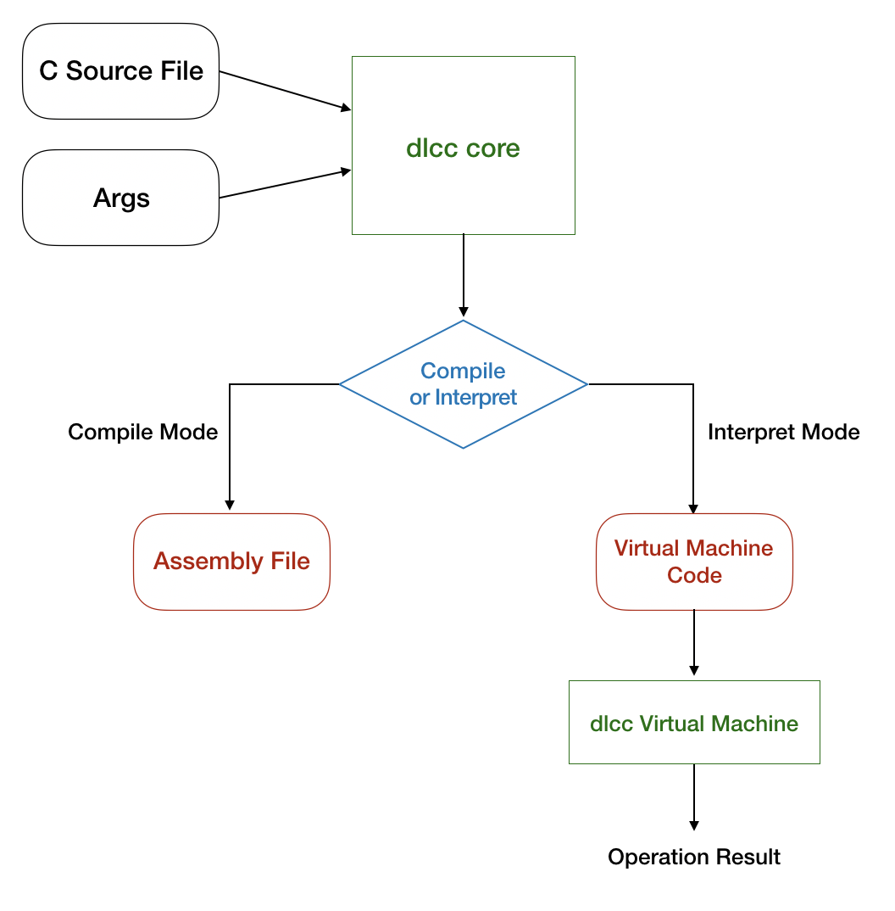
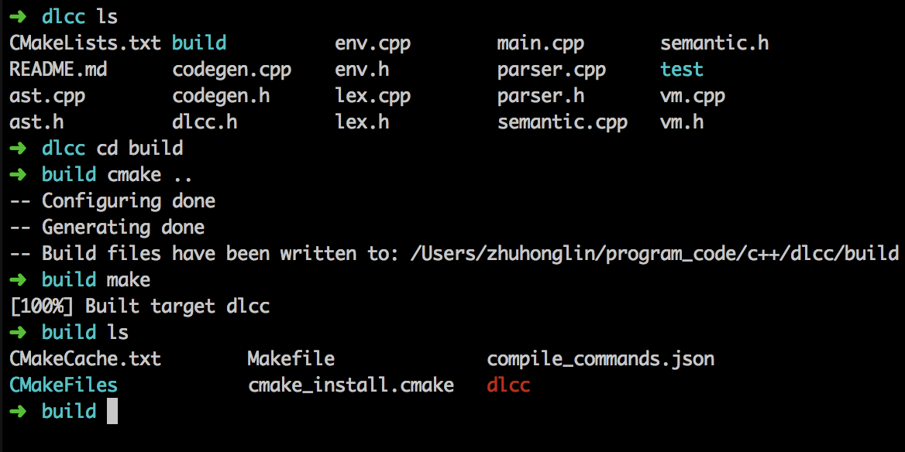
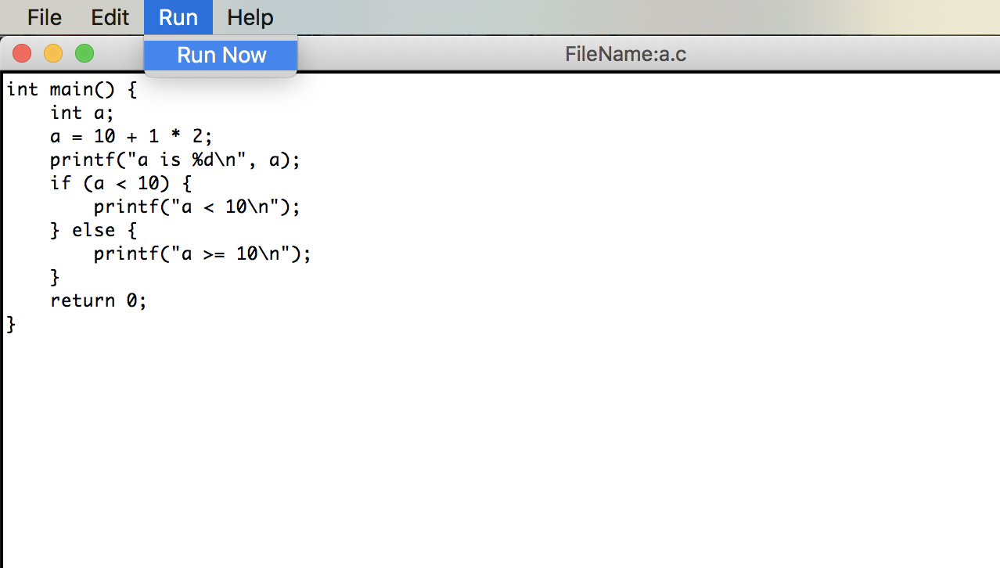

# dlcc - 简单 C 语言编译器

## 简介



输出：

- 生成 linux 32位汇编代码
- 立刻执行


## 使用

使用 cmake 构建项目，创建 build 目录

```shell
cd build
cmake ..
make
```

会在 build 下生成 dlcc 可执行文件。




dlcc 可接受参数：

- -i，解释器模式，立刻执行
- -s，汇编器模式，产生汇编代码
- -o，指明生成的汇编代码输出文件

```shell
# 例子
dlcc -i source.c
dlcc -s source.c -o source.s
```


## GUI Editer

python3

Tkinter

简易的图形化代码编辑器，集成 dlcc 编译器。使用之前需要先把 dlcc 加入环境变量




## test

dlcc 支持以下语法（interpreter mode）：

1. 计算表达式（+，-，*， /，%）

2. 逻辑表达式（>，>=，<，<=，==，|，^，&，||，&&）

3. 变量声明赋值（int）

4. C语言库函数（printf）

5. 条件判断语句

6. 循环语句

7. 函数声明、函数调用

8. 递归

test 目录下为测试文件，部分语法无法生成汇编（难），虚拟机可以支持以上全部语法。