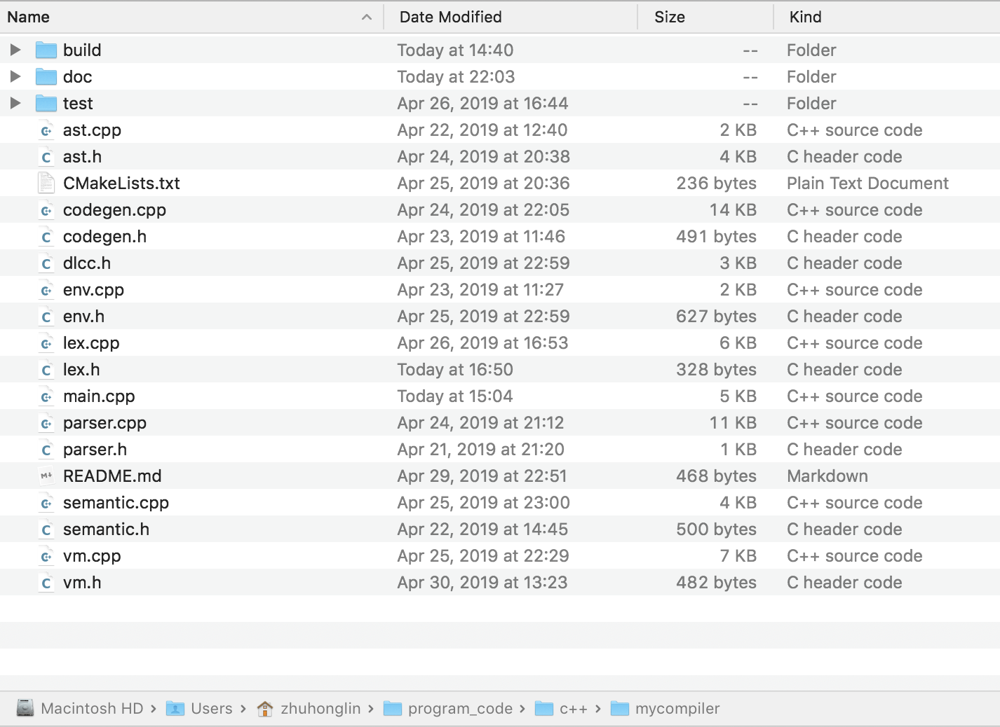

# dlcc 简单 C 语言编译器实现

## 实现综述

dlcc 简单 C 语言编译器使用 C++ 11 实现，借助 Cmake 工具对项目进行构建，使用 Clang++ 10 编译，使用 lldb 调试器进行调试。得益于构建工具的跨平台性，dlcc 可以在 macOS 和 Linux 上执行。同时 Clang 和 lldb 工具具有很好地编译信息和调试信息展示，加快了项目开发进度。

## 开发环境

开发环境：macOS Mojave

### 测试环境

* Ubuntu 16.04 x86_64
* gas 汇编器
* ld 链接器

网络上关于 Linux 平台的汇编代码的资料比较丰富，便于学习实现，并且 Linux 操作系统应用场景广泛，因此首先确保汇编代码能够在 Linux 平台被汇编执行。

Linux 平台上主要有两个有名的汇编器：gas 和 nasm。其中 gas 主要处理 AT&T 风格的汇编代码，因此选择 gas 汇编器。gas 是 GNU 计划的汇编器，拥有跨平台的特点，并且 gas 是自由软件，在 Linux 上 gas 的可执行文件简称 as。

链接器用于将多个汇编器生成的二进制文件组合，主要做了地址重定位的工作，将其整合成一整个目标平台的可执行文件。在 Unix 和 Linux 平台上，主要使用的是 ld 链接器，这款链接器同样也是 GNU 出品。

另外，Linux 平台一般都会内置 C 编译器 gcc。gcc 集成了 gas 汇编器和 ld 链接器，因此在开发和测试环节中，可以使用 gcc 代替前两个工具，他们对于同一个汇编文件的处理结果是一样的。


### 编辑器和扩展工具

Visual Studio Code（简称 VSCode），是微软牵头的一款开源编辑器，目前项目托管在知名代码托管平台 GitHub 上，社区活跃，热度很高，该项目持续被优化和升级，因此 VSCode 具有很丰富的插件和不错的响应速度，这对于开发来说十分重要。

dlcc 在 VSCode 上的开发借助了两款插件：

* c/c++（Microsoft，C/C++ IntelliSense, debugging, and code browsing）
* CMake Tools（vector-of-bool，Extended CMake support in Visual Studio Code）

前者为 C 和 C++ 工程提供了很好地代码提示信息，后者主要是对 CMake 工具的封装，能够方便快速的调用 CMake 构建项目。


## 主体实现

以下是项目的目录结构：



项目总共包括 16 个 C++ 源码文件，一个 CMakeLists.txt 文件，一个 test 目录，一个 build 目录。

### CMakeLists.txt

首先介绍项目构建如何实现。dlcc 借助 CMake 工具实现项目构建，CMake 是目前较受欢迎的 C++ 工程的构建方案，它主要的优势在于跨平台，可以基于所处的平台，生成改目标平台的 Makefile 文件，然后使用 make 命令即可构建项目。

CMakeLists.txt 的内容如下：

```cmake
cmake_minimum_required(VERSION 3.14)
project(dlcc)

set(CMAKE_CXX_STANDARD 11)

add_executable(dlcc main.cpp dlcc.h lex.cpp lex.h ast.cpp ast.h parser.cpp parser.h semantic.cpp semantic.h env.cpp env.h codegen.cpp codegen.h vm.cpp vm.h)
```

cmake_minimum_required 指出最低的 CMake 版本，project 指明项目名称，add_executable 后第一项添加可执行文件名称，之后为全部涉及的 C++ 源文件。以上三项为必须项，set 则为可选项，这里我指明使用 C++ 11 的标准编写代码。

### main 实现

在 dlcc 中定义了一些通用的全局变量，从软件开发的角度讲，这种方式并不值得提倡，但对于本项目来说，能够比较清楚的表达这些变量的意思，同时也能够简化开发流程，避免将过多的精力放在代码结构而不是编译器核心流程上。

```c++
extern string content;                          // 源文件
extern vector<pair<Token, string>> tokens;      // tokens stream
extern vector<AstNode *> ast_list;              // 语法树
extern VarEnv *top_env;                         // 顶级作用域
extern vector<string> str_data;                 // 字符串常量
extern map<string, int> var_symbol;             // var 符号表，记录 int
extern string asm_code;                         // 汇编代码
extern vector<pair<Ins, string>> vm_code;       // 虚拟指令

extern map<Token, int> op_precedence;           // 符号优先级判定
extern map<Token, string> kw_map;               // kw -> str
extern map<string, Ins> ins_map;                // str -> Ins
```

如上述所示，我定义了一系列全局变量，例如变量 content 表示源文件内容，tokens 表示词法分析器输出的 Token 流，ast_list 表示语法分析器生成的抽象语法树整体（存放多颗语法树根节点指针的数组），top_env 表示树状作用域的根作用域等。

另外我们还需要对输入参数进行处理，这虽然不是重点，但仍需小心实现：

```c++
argc--;
argv++;
string in_file_name, out_file_name;
// 命令行参数处理
while (argc > 0) {
  if (argc > 0 && **argv == '-') {
    switch ((*argv)[1]) {
      case 's':
        assembly_mode = true;
        break;
      case 'i':
        interpret_mode = true;
        break;
      case 'o':
        argc--;
        argv++;
        out_file_name = argv[0];
        break;
      default:
        printf("命令行参数错误\n");
        exit(0);
    } // switch
  } else {
    in_file_name = argv[0];
  }
  argv++;
  argc--;
}
```

接下去就是调用各个模块，使得编译器按流程工作：

```c++
Lexer lexer;
if (!lexer.lex()) {
  printf("lex error\n");
  return 0;
}

Parser parser;
parser.preprocess();
parser.parse();

Semantic::traverse_ast();
Semantic::symbol_debug();

if (assembly_mode) {
  CodeGen::gen_asm_code();
  ofstream out(out_file_name);
  out << asm_code;
}

if (interpret_mode) {
  CodeGen::gen_vm_code();
  VM vm;
  vm.run();
}
```

1. 首先调用词法分析器，进行词法分析。
2. 调用语法分析器，先进行预处理工作，接着进入语法分析
3. 语义分析，主要生成和检查符号表，生成作用域
4. 如果是汇编模式，则调用汇编代码生成器，并将代码写入指定文件中
5. 如果是立即执行模式，则调用虚拟指令生成器，并将其输出给虚拟机，虚拟机立即执行


## 词法分析实现

词法分析所需要的 Token：

| 识别字符 | Token    | 识别字符 | Token       |
| -------- | -------- | -------- | ----------- |
| int      | KW_INT   | +        | ADD         |
| 数字     | NUMBER   | -        | SUB         |
| if       | KW_IF    | *        | MUL         |
| while    | KW_WHILE | /        | DIV         |
| else     | KW_ELSE  | %        | MOD         |
| return   | KW_RET   | &        | AND         |
| 数字     | NUMBER   | ^        | XOR         |
| 字符串   | STRING   | \|       | OR          |
| =        | ASSIGN   | >        | GT          |
| ,        | COMMA    | />=      | GE          |
| :        | COLON    | <        | LT          |
| ;        | SEMICON  | <=       | LE          |
| //       | COMMENT  | ==       | EQ          |
| (        | LPAREN   | !=       | NEQ         |
| )        | RPAREN   | &&       | LAND        |
| [        | LBK      | \|\|     | LOR         |
| ]        | RBK      | \0       | END_OF_FILE |
| {        | LBRACE   |          |             |
| }        | RBRACE   |          |             |

我选择使用 C++ enum class 类型列举所有的 Token：

```c++
enum class Token : int {
    IDENTIFIER,
    NUMBER,
    KW_IF,                          // if
    KW_ELSE,                        // else
    KW_WHILE,                       // while
    KW_RET,                         // return
    KW_INT,                         // int
    STRING,                         // string
    ADD, SUB, MUL, DIV, MOD,        // +, -, *, /, %
    AND, OR, XOR,                   // & | ^
    GT, GE, LT, LE, EQ, NEQ,        // >, >=, <, <=, ==, !=
    LAND, LOR,                      // &&, ||
    LPAREN, RPAREN,                 // ( )
    LBK, RBK,                       // [ ]
    LBRACE, RBRACE,                 // { }
    ASSIGN,                         // =
    COMMA, COLON, SEMICON,          // , : ;
    COMMENT,                        // "//"
    END_OF_FILE = -1,
    ERR = -2
};
```

词法分析主要输入是字符串流，对应的变量是 content，输出是 Token 流，对应变量 tokens。tokens 变量较为复杂，是一个复合变量，tokens 整体是一个变长数组，这个数组的每一项是一个 pair 结构，保存 Token 和相关字符串信息。

词法分析的主要环节在于词法分析器对于字符的处理，首先过滤一些特殊字符，如空格，换行，tab。

接下去解析 identifer，根据 C 语言的描述，标识符由 26 个字母或者下划线开头，之后的字符可以是 26 个字母或者数字或者下划线。根据描述写出如下代码：

```c++
// identifier
// [a-z | A-Z | _] {_ | a-z | A-Z | 0-9}
if (isalpha(cur_char) || cur_char == '_') {
  string idname;
  idname += cur_char;
  cur_char = content[pos_++];
  while (isalnum(cur_char) || cur_char == '_') {
    idname += cur_char;
    cur_char = content[pos_++];
  }
  --pos_;
  if (idname == "if") {
    tokens.emplace_back(make_pair(Token::KW_IF, idname));
    return Token::KW_IF;
  } else if (idname == "else") {
    tokens.emplace_back(make_pair(Token::KW_ELSE, idname));
    return Token::KW_ELSE;
  } else if (idname == "while") {
    tokens.emplace_back(make_pair(Token::KW_WHILE, idname));
    return Token::KW_WHILE;
  } else if (idname == "int") {
    tokens.emplace_back(make_pair(Token::KW_INT, idname));
    return Token::KW_INT;
  } else if (idname == "return") {
    tokens.emplace_back(make_pair(Token::KW_RET, idname));
    return Token::KW_RET;
  }
  tokens.emplace_back(std::make_pair(Token::IDENTIFIER, idname));
  return Token::IDENTIFIER;
}
```

首先词法分析器读入一个字符，然后判断是否为 26 个英文字母之一或者是否为下划线，如果是，则进入标识符判定分支。进入分支后，一一读取字符，直到字符不满足标识符条件为止，此时标识符信息存储在 idname 变量中。接着进行标识符比对，例如比对 if 成功，则说明标识符为 if 表示符，将其存储于 tokens 中，并返回识别信息，其余同理，若不匹配就报错。

词法分析器还需要识别数字，各种符号等，这些细节与识别标识符的原理是类似的，这里就不再展开了。其中有一点需要注意，某些标识符需要多向后看 n 个字符才能够确定，例如 =（Token::ASSIGN）和 ==（Token::EQ）标识符，分别表示赋值标识符、是否相等标识符，如果只看一个等号是不足以判断两者的，因此需要再向后看一个字符：

```c++
case '=': {
  // "=="
  if (content[pos_] == '=') {
    pos_++;
    tokens.emplace_back(make_pair(Token::EQ, "=="));
    return Token::EQ;
  }
  // '='
  tokens.emplace_back(make_pair(Token::ASSIGN, "="));
  return Token::ASSIGN;
}
```

其他还有类似的情况，如 Token::GE 和 Token::GT、Token::AND 和 Token::LAND 等，处理的原理相同，均采用向后看的策略。


## 抽象语法树实现

由于语法分析器的实现需要使用抽象语法树结构，因此，在介绍语法分析实现之前，需要先实现抽象语法树结构。

C 语言具有多种语法表达，因此用同一个结构体（Struct）或者类（Class）来表述所有的语法是比较困难的，于是首先得想法是设计多个 Struct，一一表示各种不同的语法结构，但是实际上我需要将这些 Struct 看成一个个语法树的节点，然后将其组织成一个整体（一整颗语法树或者保存多个语法树根节点指针的数组），对于这个整体，在之后的语义分析和代码生成阶段需要进行多次遍历，因此我需要用一种通用的结构来表示所有的 Struct。

具体实现中我有两个相对简单的选择：使用 void 指针表示所有 Struct、使用继承多态特性，让父类指针指向子类实例。我选择了后一个方案，因为它更容易实现，也更容易排查编码错误。

```c++
class AstNode {
  public:
    virtual ~AstNode(){};
    virtual void print() {}
    virtual AstType get_ast_type() = 0;
};

class VarDecAst : public AstNode {
  public:
    string name_;
    Token type_;
    VarEnv *env_ = nullptr;

    explicit VarDecAst(Token type, string &name) : type_(type), name_(name) {}

    AstType get_ast_type() override { return AstType::VARDEC; }
    void print() override;
};
```

上面展示了父类 AstNode，然后展示了其中一个子类 VarDecAst，变量声明语法树。VarDecAst 具有三个成员，变量类型、变量名字和变量作用域。关于作用域之后会解释。这个类说明了如果在语法中出现声明变量的语句，需要将其组织成这样一颗语法树。其余的语法树也具有相似的结构，这里就不多展开了。这些语法树类都继承自 AstNode，同时实现（Implement）父类要求的方法，例如 get_ast_type 方法，将会返回语法树自身的类型。


## 语法分析实现

### 语法简介及结构

语法分析主要流程是对 Token 流进行遍历，然后构建出一颗抽象语法树。

语法展示：

```c++
Statement ::= If_Statement | While_Statement | Declaration | Func_Return | Expression

If_Statement ::= “if” "(" Expression ")" "{" Statement "}"
If_Statement ::= “if” "(" Expression ")" "{" Statement "}" “else” "{" Statement "}"

While_Statement ::= “while” “(“ Expression “)” "{" Statement "}"

Expression ::= Number | Identifier | Expression OP Expression

Declaration ::= Func_Declaration | Var_Declaration

Var_Declaration ::= Type Identifier [“=” Expression] {, Identifier ['=' Expression]} “;” 

Func_Declaration ::= Type Identifier “(“ Args “)” "{" Statement "}"

Func_Return ::= “return” Expression
```

语法分析器工作流程：

> 流程图

语法分析使用递归下降的语法方式，使用向后看的策略消除歧义，以下是语法分析器核心结构：

```c++
class Parser {
    int pos_ = 0;
    pair<Token, string> cur_token_; // 当前扫描到的 token
  public:
    pair<Token, string> &get_next_token();
    void preprocess(); // 对 tokens 进行预处理
    bool parse();
    AstNode *parse_statement();
    AstNode *parse_number();
    AstNode *parse_string();
    AstNode *parse_identifier();
    AstNode *parse_paren_exp();
    AstNode *parse_expression();
    AstNode *parse_block();
    AstNode *parse_if_exp();
    AstNode *parse_while_exp();
    AstNode *parse_dec();
    AstNode *parse_func_dec();
    AstNode *parse_var_dec();
    AstNode *parse_func_ret();
    // parse expression, deal stack
    AstNode *deal_exp_stack(stack<AstNode *> &ast_stack,
                            stack<Token> &op_stack);
    void parse_debug();
};
```

### 预处理

语法分析首先执行预处理操作，预处理是对 token 流进行预处理，主要目的是为了简化语法分析的复杂性。

例如，在 C 语言的语法中，可以使用如下表达：

```c
int a;
a = 1;
// 可以写成一行
int a = 1;
```

dlcc 将声明和赋值看成两个操作，一个变量首先被声明，然后才能被赋值，因此实际上 dlcc 的语法分析器不支持最后一行的写法，必须拆成前面两行的写法。但是用户输入的时候，是可以写成最后一行的形式的，原因在于，语法分析器在进入分析之前，首先进行了预处理，将语法拆成了声明和赋值分开的形式。

预处理器一方面能够保证用户能够使用较多的语法表达，甚至某些语法糖的实现，另一方面也能减小语法分析器的复杂度，使得语法分析器能够尽量简单。


### 递归下降

递归下降是一种语法分析方法，它属于自顶向下分析算法的一种。自顶向下的含义就是从第一个非终结符开始，不断将其分解，直到匹配为终结符的过程。一般来说这个过程的执行，会不断地匹配不同的语句，于是在这个过程中，构建抽象二叉树，以下一构建 if 语句的抽象语法树为例：

```c++
AstNode *Parser::parse_if_exp() {
    get_next_token(); // eat "if"
    AstNode *cond = parse_paren_exp();
    AstNode *if_block = parse_block();
    AstNode *else_block = nullptr;
    if (cur_token_.first == Token::KW_ELSE) {
        get_next_token(); // eat "else"
        else_block = parse_block();
    }
    return new IfExpAst(cond, if_block, else_block);
}
```

首先明确 if 分支语句包含三个部分：条件表达式，分支一代码块，分支二代码块。其中分支一代码块表示 if 条件表达式成立执行的表达块，分支二代码块则是 else 代码块，这取决于用户写不写 else 分支。当程序进入解析 if 结构的函数时，首先解析条件表达式，得到一个表达式语法树，然后解析出分支一代码块语法树，接着如果存在 else 分支的话，就解析出分支二代码块语法树。最后将这三部分插入 if 语句的抽象语法树中，返回结果。至此就得到了一个 if 语句的抽象语法树。

语法分析的流程就是不断地解析已知的语法结构，然后产生对应的树结构，最后将一个个抽象语法树组织成一个整体（可能是一棵树，或者包含多个树根节点指针的数组）。


## 符号表与作用域实现

### 作用域

符号表和作用域也具有自己的特有的结构，首先介绍作用域：

```c++
class VarEnv {
  public:
    static int env_cnt_; // 统计创建的环境(作用域)个数
    static tuple<VarEnv *, bool> get_var_env(string &name, VarEnv *cur_env);

    VarEnv *prev_, *next_, *fa_, *fch_, *lch_;
    int scope_id_;
    map<string, Token> var_symbol_;

    VarEnv();
    void add_child_env(VarEnv *child);
    bool var_exist(string &name);
    void print_info();
};
```

一个 block 即产生一个作用域，如同设计章节中描述的，作用域使用树状的结构，因为不同作用域之间存在着包含关系，能够被节点的父子关系表达。整个作用域使用孩子兄弟表示法（Left-Child Right-Sibling Representation of Tree），为了方便遍历，同时加入了向上表示父节点的指针，表示前一个兄弟的指针，表示最后一个孩子的指针。

作用域还有另外两个重要的成员变量，scope_id_ 表示作用域的唯一标识，用于标识不同的作用域，该值唯一。var_symbol_ 即该作用域范围内的符号表。


### 符号表

构建的符号表可以比较简单，记录符号的名字和类型即可，变量的值等一些类必要的信息可以在代码生成阶段再构建。值得注意的是一个作用域一个符号表，这意味着同一个作用域内符号表的变量名一定是唯一的。


## 语义分析实现

```c++
class Semantic {
  public:
    // 生成符号表信息
    static void traverse_ast();
    static void gen_symbol(AstNode *node, VarEnv *cur_env);

    static void symbol_debug();
    static void print_symbol_info(VarEnv *e);
};
```

dlcc 的语义分析主要是对语法分析产生的原始语法树进行遍历，在遍历的过程中，建立符号表和作用域信息，当出现类型的的时候还应进行类型检查等操作。以检查函数声明语法树为例：

```c
switch (node->get_ast_type()) {
    case AstType::FUNC: {
        // 将函数加入函数符号表
        auto *func = dynamic_cast<FuncAst *>(node);
        auto *env = new VarEnv();
        cur_env->add_child_env(env);
        func->env_ = cur_env;
        // args
        for (auto &arg : func->args_) {
            env->var_symbol_.insert(make_pair(arg.second, arg.first));
            var_symbol.insert(
                make_pair(arg.second + to_string(env->scope_id_), 0));
        }
        // block
        auto *block = dynamic_cast<BlockAst *>(func->block_ast_);
        for (auto stat : block->stats_) {
            gen_symbol(stat, env);
        }
        break;
    }
    // 其他 case ...
```

对于一个函数语法树节点，首先为其添加所属作用域信息。因为函数内部产生了新的作用域，所以新建子作用域，函数内部的变量都将属于这个子作用域。这里需要注意的是，函数的形参应当属于子作用域，因为形参将会在函数体内部被使用。


## 汇编代码生成


## 虚拟代码生成


## 虚拟机实现


